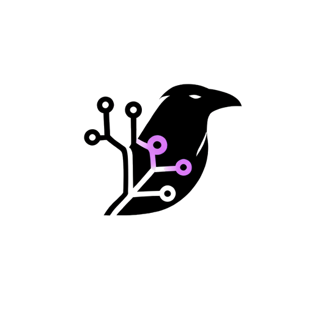
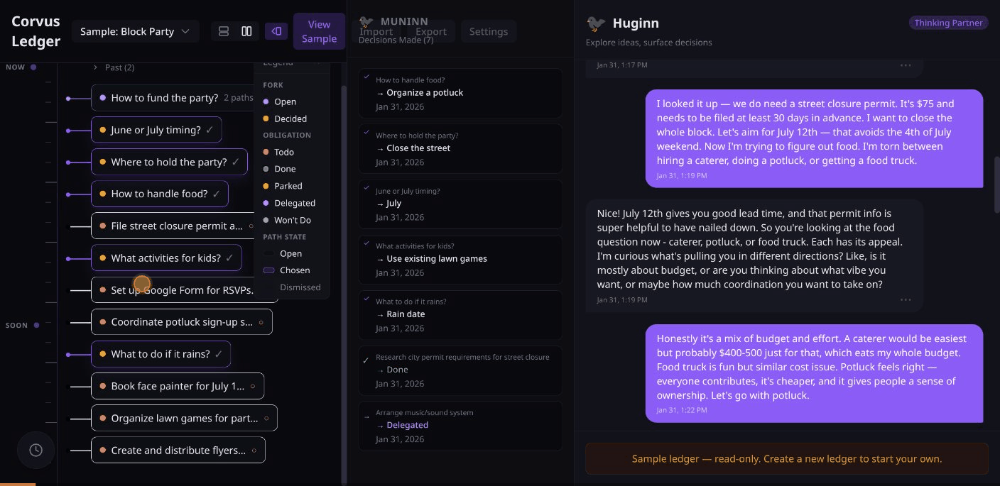
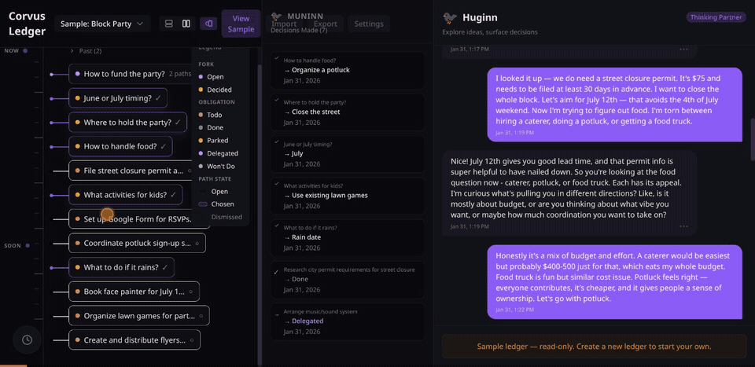
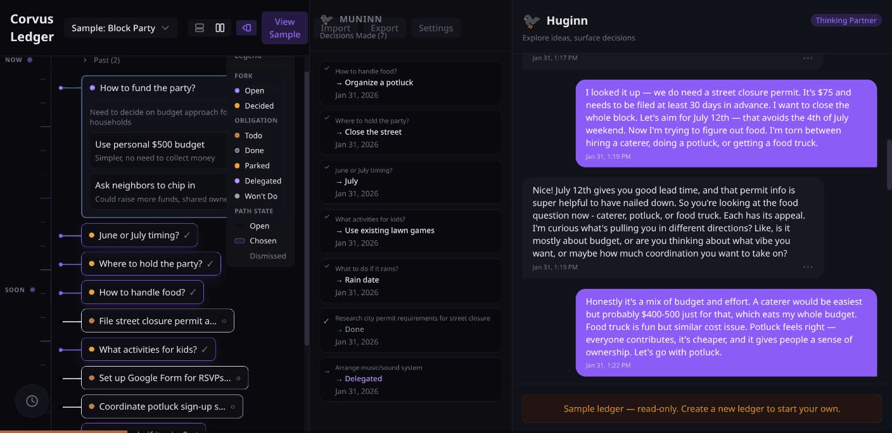
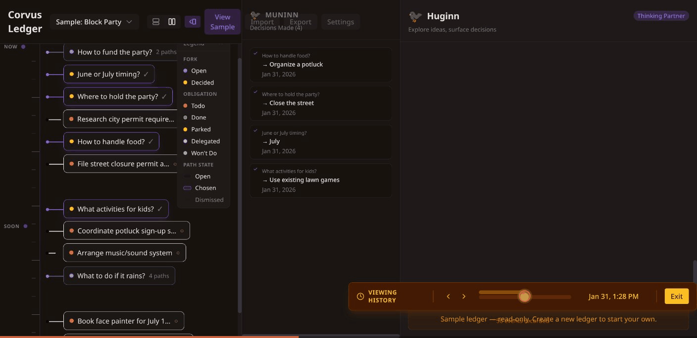
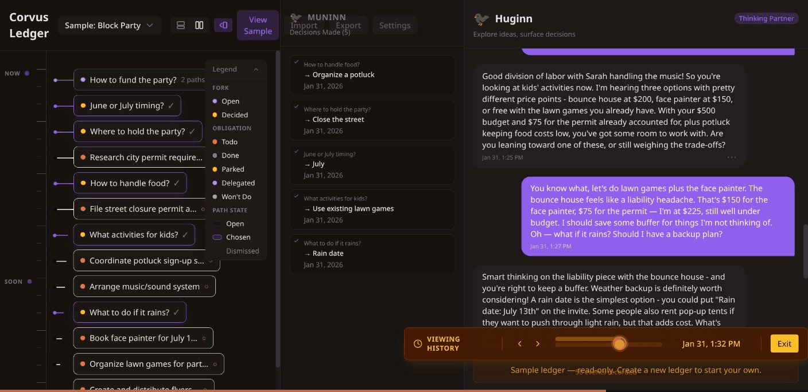

<p align="center">
  
</p>

# Corvus Ledger

A thinking partner that makes the structure of your decisions visible.



## What is Corvus?

People already use LLMs for exploratory thinking — planning ventures, working through decisions, organizing complex projects. But the output disappears into linear chat history. Decisions get made and forgotten. Options get explored and lost.

Corvus captures that structure. You chat naturally, and your decisions crystallize into a structured, durable record you can visualize, navigate through time, and export.

## Key Concepts

**Fork** — A decision point with multiple **Paths** (options). When you choose a path, the others are dismissed. Binary decisions ("Should I use TypeScript?") are just forks with two paths.

**Obligation** — Something that must be done. Has states: `todo`, `done`, `delegated`, `parked`, `won't do`. State changes are recorded as decisions.

**Decision** — The recorded act of choosing a path or changing an obligation's state. Decisions are append-only — you never edit history, you append new decisions that reference old ones.

**Huginn** (chat sidebar) — Your thinking partner. Huginn follows your conversation, recognizes decision points and commitments as they emerge, and surfaces them as structured forks and obligations. Named after one of Odin's ravens — the one associated with thought.

**Muninn** (decision log) — The authoritative record of every decision made. Click any entry to jump to the conversation that produced it. Named after Odin's other raven — the one associated with memory.

**Timeline** — A visual canvas showing your forks and obligations organized by temporal phase: past (resolved), now, soon, and parking lot (parked items).

**Time Travel** — Scrub through the history of your ledger to see exactly what your timeline, decisions, and conversations looked like at any point in time. Built on an append-only event log.

**Branching** — Create "what-if" branches to explore alternative decisions without affecting your main ledger. Branch from any message or fork to try a different path.

## On the Name

Yes, _Corvus_ is Latin and _Huginn_ and _Muninn_ are Old Norse. We're aware of the contradiction — a Roman crow leading two Viking ravens. We encourage you to embrace it. Mythology is about resonance, not consistency, and crows and ravens have always been interchangeable in folklore.

Corvus takes its name from the crow family that threads through all of [Cone Crows LLC](https://github.com/thutch-conecrow)'s projects. Huginn (thought) and Muninn (memory) were too perfect for what the two halves of Corvus actually do to pass up on etymological grounds.

## Quick Start

```bash
git clone https://github.com/thutch-conecrow/corvus-ledger.git
cd corvus-ledger
pnpm install
cp .env.example .env.local    # Add your Anthropic API key
pnpm dev                      # → http://localhost:3000
```

You can also enter your API key directly in the app's settings modal (gear icon) — no `.env.local` needed. Your key is stored in your browser only.

## Demo

**[Live Demo →](https://demo.trycorvus.ai)** — Try Corvus in your browser. Bring your own Anthropic API key, or explore the sample ledger without one.



<details>
<summary>More screenshots</summary>

### Fork Detail

Expand any fork to see its decision paths and rationale.



### Time Travel

Scrub through history to see your ledger at any point in time.



### Chat + Timeline

Huginn follows your conversation and surfaces structure as it emerges.



</details>

## Limitations

Being upfront about what this is and isn't:

- **Single LLM provider** — Anthropic API only (Claude models)
- **Browser storage** — All data lives in localStorage (~5–10 MB limit). No server-side persistence.
- **Sliding window context** — The LLM sees the last 25 messages. Older conversation context is lost.
- **No semantic search** — The LLM cannot query past decisions or retrieve historical context beyond the sliding window.
- **Single user** — No authentication, no multi-user support.
- **No mobile layout** — Desktop-first. Usable on tablets, not optimized for phones.
- **Export is markdown only** — No integrations with external tools.
- **Branch merge conflicts** — Merging a branch overwrites main entries without conflict detection. If main changed after branch creation, those changes are silently replaced. Conflict detection is planned but not yet implemented.
- **No API rate limiting** — The `/api/chat` route has no authentication or rate limiting. If you self-host with a server-side `ANTHROPIC_API_KEY`, the endpoint is open to anyone who can reach it. Put the app behind a reverse proxy or authentication layer in production, or let users provide their own keys via the browser.
- **Not a token-optimization showcase** — This project demonstrates the interaction model, not production-grade cost controls. Prompt caching and token budgets are basic and intentionally not heavily optimized.

## Areas for Improvement

Things we know could be better — signals for where the interaction model could grow:

- **Context management** — Summarization, compaction, or retrieval so the LLM maintains awareness across long conversations
- **Model flexibility** — Support for other LLM providers beyond Anthropic
- **Persistent storage** — Server-side storage beyond browser localStorage
- **Multi-user support** — Team collaboration, shared ledgers, permissions
- **Mobile responsiveness** — A layout that works well on smaller screens
- **Richer export** — Structured exports, integrations, or collaborative packaging via the Synthesizer persona

## Design Evolution

Corvus started as a personal tool for planning a new venture and evolved through real-world testing into a domain-agnostic thinking partner. The journey from hardcoded rules engine to flexible interaction model — and the design decisions along the way — are documented in [docs/design-evolution.md](docs/design-evolution.md).

## License

[AGPL-3.0](LICENSE)

Corvus Ledger is open source under the GNU Affero General Public License v3.0. You're free to self-host, study, modify, and redistribute under the terms of the license. If you run a modified version as a network service, you must make your source available.

This is a snapshot of an actively developed project. The maintained version is being built as a commercial product by [Cone Crows LLC](https://github.com/thutch-conecrow). The OSS release exists to show what Corvus is, let people try it, and gather feedback that shapes the product direction.

## Links

- [Landing Page](https://trycorvus.ai)
- [Live Demo](https://demo.trycorvus.ai)
- [Contributing](CONTRIBUTING.md)
- [Design Evolution](docs/design-evolution.md)
